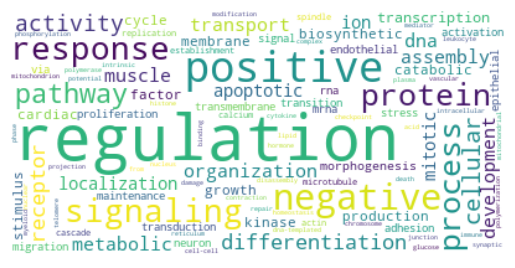

# About 

## Content {data-width=50}
### {.opening-page-text}

KinAce

Welcome to the KinAce visualization portal! Our goal is to enable visualizing the network of <b>kinase-substrate interactions</b> in the human genome. On this portal, you will be able to:

* <b>examine a single protein</b> and its interactions with other kinases and substrates,
* <b>visualize a pathway</b> and its kinase-substrate interactions,
* import and <b>visualize a custom gene set</b> and its kinase-substrate interactions.

<h3>FAQ</h3>
<h4>Where is the data from?</h4>
We aggregate interactions from [PhosphoSitePlus](https://www.phosphosite.org/), [iPTMnet](https://research.bioinformatics.udel.edu/iptmnet/) and [EPSD](https://epsd.biocuckoo.cn/). 
<h4>Who maintains the site?</h4>
The portal is jointly maintained by [Pandey](https://gpandeylab.org/) and [Schlessinger](http://www.schlessingerlab.org/) labs at [Icahn School of Medicine at Mt. Sinai, New York](https://icahn.mssm.edu/). For more information, contact [John Sekar](mailto:john.sekar@mssm.edu).

## Image {data-width=50}
{width="500px"}

Word cloud of names of pathways enriched in kinases and their substrates

{width="500px"}

Flow diagram of kinase-kinase interactions across kinase groups, showing targeting kinase on the left and the targeted kinase (substrate) on the right." 

