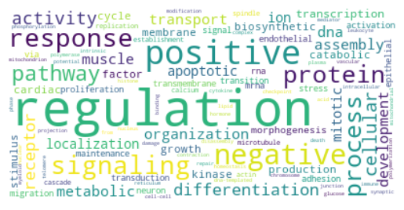
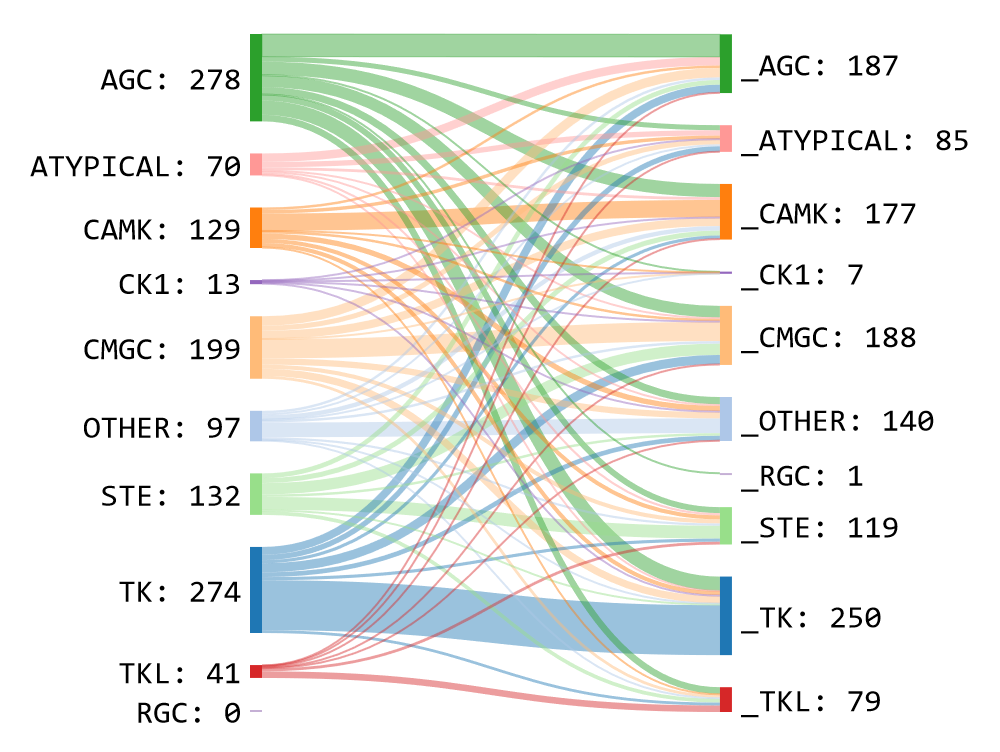

```{r}
library(flexdashboard)
```
# About {.hidden}


## Image {data-width=20}
####
```{r, cache=FALSE}
  (downloadButton('download0',HTML("DOWNLOAD<br/>The full KiNet interaction dataset"),class="download-full"))
  
  output$download0 <- downloadHandler(
    filename=function() {"ksi_source_full_dataset.csv"},
    content = function(file) {
  ### First to create from raw file ###
  # raw_df <- read_csv("data/ksi_source_evi_ref.csv")
  # node_dropped_repeats <- all_nodes[!duplicated(all_nodes$id),]
  # data_ <- merge(raw_df, 
  #                node_dropped_repeats[c('id', 'GeneName')], 
  #                by.x=c('Kinase'), by.y=c('id'), all.x = TRUE) %>% rename("Kinase Name" = GeneName)
  # 
  # data <- merge(data_, 
  #                node_dropped_repeats[c('id', 'GeneName')], 
  #                by.x=c('Substrate'), by.y=c('id'), all.x = TRUE) %>% rename("Substrate Name" = GeneName)
  # print(colnames(data))
  # data$siteNum <- unlist(lapply(substring(data$Site, 2), as.integer))
  # print('test1')
  # data <- data[order(data$Kinase, data$Substrate, data$siteNum, data$PrimarySource), ]
  # data <- data %>% rename(
  #                       "Source Database"=PrimarySource,
  #                       "Reference (PMID)"=pmid_ref,
  #                       "Evidence"=evidence
  #                       
  #                       )
  # data <- data[,c('Kinase', 'Kinase Name', 'Substrate', 'Substrate Name', 'Site', 'Source Database', 'Evidence','Reference (PMID)')]
  # data <- data[!duplicated(data),]
  # insertIndex <- which(!duplicated(data[c('Kinase', 'Substrate')]), arr.ind = TRUE)
  # # if ((insertIndex[1] == 1) & (insertIndex[2] == 2)) {
  # if (length(insertIndex) > 2) {
  #   insertIndex2 <- c(insertIndex[2]-1, insertIndex[3:length(insertIndex)])
  #   dataWithEmptyRows <- insertRows(data, insertIndex2, new="", rcurrent=TRUE)
  # } else {
  #   dataWithEmptyRows <- data
  # }
  # 
  # write.csv(dataWithEmptyRows,file,row.names=F)
  
  ### just copy the existing one ###
      file.copy("data/ksi_source_full_dataset.csv", file)
      }
  )
```
####
### {}
```{r}
valueBoxOutput('vbox_kinases')
output$vbox_kinases <- renderValueBox({
  valueBox(value=n_kinases,caption=tags$p("Kinases",class="opening-page-text"),icon="fa-solid fa-k")
  })
```
### {}
```{r}
valueBoxOutput('vbox_nonkinases')
output$vbox_nonkinases <- renderValueBox({
  valueBox(value=n_nonkinases,caption=tags$p("Non-kinases",class="opening-page-text"),icon="fa-solid fa-s")
  })
```
### {}
```{r}
valueBoxOutput('vbox_interactions')
output$vbox_interactions <- renderValueBox({
  valueBox(value=n_interactions,caption=tags$p("Interactions",class="opening-page-text"),icon="fa-solid fa-i")
  })
```
### {}
```{r}
valueBoxOutput('vbox_kki')
output$vbox_kki <- renderValueBox({
  valueBox(value=n_kki,caption=tags$p("Kinase-kinase interactions",class="opening-page-text"),icon="fa-solid fa-kip-sign")
  })
```
### {}
```{r}
valueBoxOutput('vbox_auto')
output$vbox_auto <- renderValueBox({
  valueBox(value=n_auto,caption=tags$p("Autophosphorylations",class="opening-page-text"),icon="fa-solid fa-a")
  })
```


## Content {data-width=50}
### {}

<p style="font-family: 'Righteous', cursive; font-size: 80px; text-align: center;">KiNet</p>
<p style="font-size: 18px; text-align: center;"><i>A web-portal for kinase-substrate interactions in human cells.</i></p>
#### {.opening-page-text data-height=250}

<!--p style="font-family: 'Righteous', cursive; font-size: 80px; text-align: center;">KiNet</p-->
<div style="padding: 2px 2px 2px 2px; text-align: justify;">
<h3>Welcome</h3>
The KiNet web portal aggregates and visualizes the network of interactions between **protein-kinases** and their **substrates** in the human genome. To begin, click on one of the tabs above. Each tab provides a unique way to select a set of proteins and display the known kinase-substrate interactions between them.
<ul>
<li>**Proteins**: select a kinase or substrate protein and its interacting partners.</li>

<li>**Pathways**: select kinases and substrates belonging to a curated pathway.</li>

<li>**Domains**: select kinases and substrates enriched in specific domains.</li>

<li>**Custom protein sets**: import a custom set of proteins that includes kinases and their substrates.</li>
</ul>
<h3>Visualizations</h3>
Each tab displays the selected interactions as a network diagram. A directed edge indicates an interaction from a specific kinase to a particular substrate. Nodes representing proteins are colored grey if they are non-kinases, or by the respective kinase group.

This website is best viewed on larger screens.
<h3> Data sources </h3>
KiNet uses
<ul> 
<li> interactions from [PhosphoSitePlus](https://www.phosphosite.org/){target="_blank"}, [iPTMnet](https://research.bioinformatics.udel.edu/iptmnet/){target="_blank"} and [EPSD](https://epsd.biocuckoo.cn/){target="_blank"} downloaded in October, 2023, </li>
<li> kinase group information from [KinHub](http://kinhub.org/){target="_blank"}, [Coral](http://phanstiel-lab.med.unc.edu/CORAL/){target="_blank"} and the [Dark Kinase Knowledgebase](https://darkkinome.org/){target="_blank"}, </li>
<li> protein names from [UniProt](https://www.uniprot.org/uniprotkb?query=human&facets=reviewed%3Atrue%2Cmodel_organism%3A9606){target="_blank"}, </li>
<li> gene symbols from [HGNC](https://www.genenames.org/){target="_blank"} </li>
<li> sets of proteins from select pathways in [KEGG](https://www.genome.jp/kegg/pathway.html){target="_blank"}, </li>
<li> sets of proteins having select domains from [InterPro](https://www.ebi.ac.uk/interpro/){target="_blank"}. </li>
</ul> 


<h3>Contact</h3>
KiNet is jointly maintained by [Pandey](https://gpandeylab.org/) and [Schlessinger](http://www.schlessingerlab.org/) labs at [Icahn School of Medicine at Mt. Sinai, New York](https://icahn.mssm.edu/). 

If you find KiNet useful, please cite our paper ([bioRxiv](https://doi.org/10.1101/2023.12.08.570875){target="_blank"}):

<b> KiNet: a web portal for exploring kinase-substrate interactions. </b>
<br>
<i> John A.P. Sekar, Yan Chak Li, Avner Schlessinger, Gaurav Pandey </i>

<!-- For more information, contact [John A.P. Sekar](mailto:john.sekar@mssm.edu). -->
For more information, contact [Gaurav Pandey](mailto:gaurav.pandey@mssm.edu). 
</div>


<!-- ##### Word cloud of pathway names enriched in kinase substrates -->
<!-- {width="400px"} -->

<!-- ##### Flow diagram of kinase-kinase interaction data, organized by kinase-group -->
<!-- {width="400px"} -->


